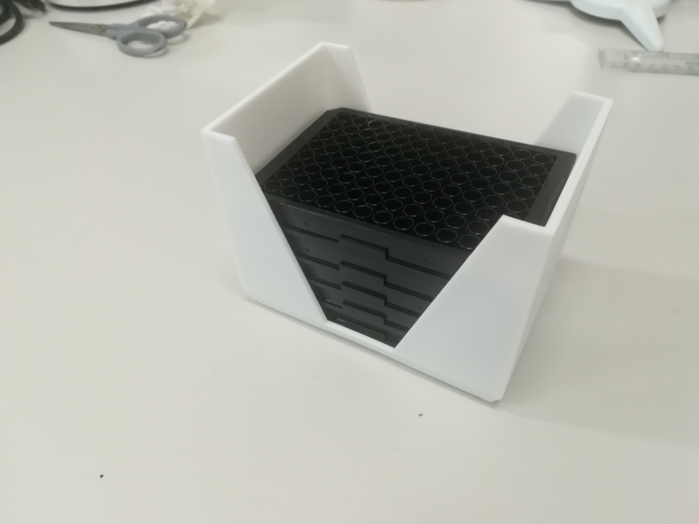

### Plate holder

I designed this to carry a stack of 5 or so plates

I designed it around an stl file of a [96 well plate](20190620_PlateCarrier_Black96WellPlates.jpg) that I found on the [NIH 3D print exchange](https://3dprint.nih.gov/discover/3dpx-000303)

My [first iteration](20190606_SBSPlateHolder.stl) was ok, except I tapered it oo much at the bottom, so the plates don't sit flush.
